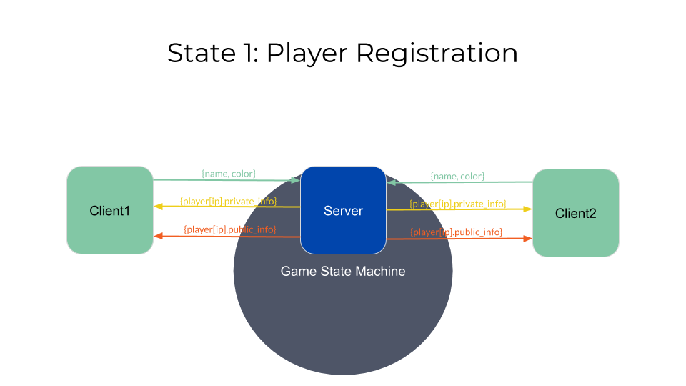

# New World
EE599 - Computing and Software for Systems Engineers - Spring 2020 <br>
University of Southern California Viterbi School of Engineering

Final Project - a full-stack implementation of a popular board game

Author(s): Spencer McDonough

## Introduction
This application is a light-weight multiplayer implementation of the popular board game "Settlers of Catan." It makes use of NodeJS express to run the backend and SocketIO as the communication framework. The front end serves purely as a viewport and input source for each client. All functionality is reserved for the backend save for some simple input handling. When a client connection is made, the server consults an internal game state machine and connection counter to regulate the admission of the client into the game. If they are admitted, all following actions are again filtered and regulated based on the internal game state machine and connection statistics. 

The major advantage of using SocketIO as the communication framework as opposed to a typical REST API is that server --> client communication is made much easier. When a client connects to the server, the connection remains open for the duration of the game. Only when the client closes their browser or refreshes the page is the connection terminated. This allows the server to asynchronously update the clients without the clients needing to issue a request to do so.

A visual description of this process can be found at the end of this readme.

## Game Play
Here's an example of what the front end currently looks like for a full game:

## Compilation Instructions
```bash
git clone https://github.com/smcd253/new-world.git
cd new-world/
npm install expresss
npm install socket.io

node server.js
```

## Play Game
Enter "localhost:5000" into your browser.

### Testing
```bash
npm install mocha
sudo apt-get install mocha # for linux users
```
**Client-Server Communincation**
```bash
cd tests
# in terminal 1
node server.js
# in terminal 2
mocha test_server.js
```
**Game Manager Unit Tests**
```bash
cd tests
mocha test_game_manager.js
```

## Client-Server Game Model
 <br>
 <br>
Clients start by establishing a SocketIO connection, wherein the server responds by prompting the client to enter their player information.
 <br>
Clients then send their information to the server, wherein the server attaches the client's connection to a SocketIO "Room" (our game room), sends the new client their private player information (resources in hand, structures left, etc.), and broadcasts the new client's public player information (score, number of resources, etc.).
 <br>
Once at least 2 players have joined (the maximum for this version is 4 players), they can shuffle the board, and press 'start game,' at which point the state machine moves into the "Board Setup" state where players can place their starting pieces. The server broadcasts updates whenever a client makes an action, allowing all clients to redraw their boards accordingly.
 <br>
Once the setup phase is over, the state machine moves into the game state where players take turns rolling the dice. When the dice is rolled, each client will receive the resources associated with the tiles that boarder their pieces if the number on said tiles match the dice roll result. This information is sent directly to each client, and the number of cards and dice roll result are broadcasted to all clients.
 <br>
The second phase of each turn allows the player whose turn it is to place pieces if they have the proper resources. This phase matches the "board setup" state described earlier except now each player is charged resources for placing a piece.
 <br>
The game finishes when a player places a piece and their score crosses the "winning_score" threshold. This forcees the game to enter into the "end_game" state where no more modifications can be made.

## Demonstration
[YouTube](https://www.youtube.com/watch?v=OT_Ji8IMt7c&feature=youtu.be)
